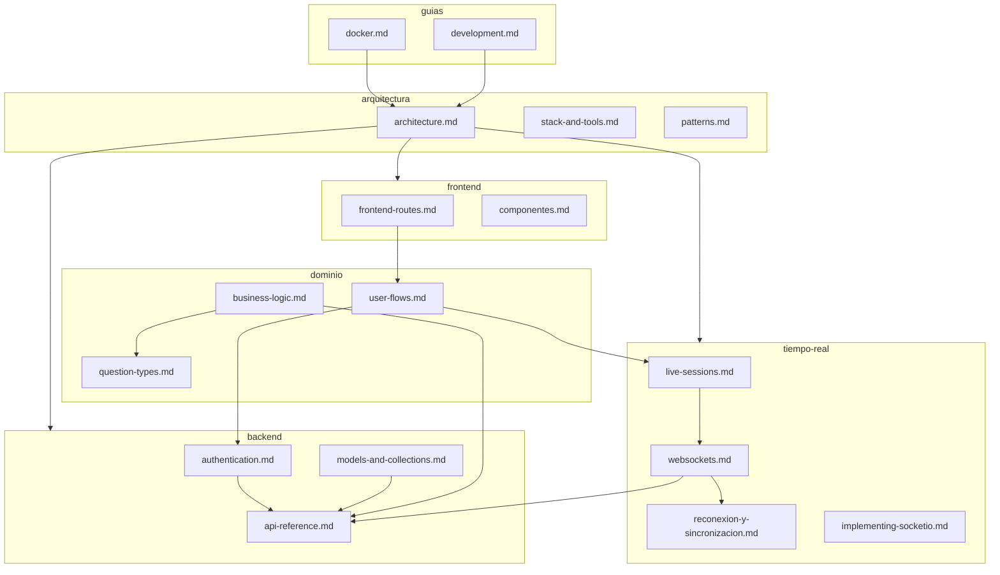

# Electro Quiz — Documentación

Plataforma educativa de quizzes en tiempo real (estilo Kahoot). Los docentes crean quizzes y conducen sesiones en vivo con PIN; los estudiantes se unen, responden y ven resultados.

## Mapa de la documentación

```
docs/
├── README.md                 ← estás aquí (índice general)
├── guias/                    Cómo instalar, desarrollar y desplegar
├── arquitectura/             Diseño técnico, stack y convenciones
├── dominio/                  Reglas de negocio y flujos de usuario
├── backend/                  API REST, auth y persistencia MongoDB
├── frontend/                 Rutas, páginas y componentes UI
├── tiempo-real/              Sesiones live, WebSockets y reconexión
└── legacy/                   Docs antiguas (era Firebase) — referencia histórica
```

## Cómo se relacionan las secciones



**Lectura sugerida por rol:**

| Si eres… | Empieza por… | Luego… |
|----------|--------------|--------|
| Nuevo en el repo | [guias/development.md](./guias/development.md) | [arquitectura/architecture.md](./arquitectura/architecture.md) |
| Backend / API | [backend/](./backend/README.md) | [tiempo-real/websockets.md](./tiempo-real/websockets.md) |
| Frontend | [frontend/](./frontend/README.md) | [dominio/user-flows.md](./dominio/user-flows.md) |
| DevOps / deploy | [guias/docker.md](./guias/docker.md) | [arquitectura/stack-and-tools.md](./arquitectura/stack-and-tools.md) |
| Producto / QA | [dominio/](./dominio/README.md) | [tiempo-real/live-sessions.md](./tiempo-real/live-sessions.md) |

---

## Índice por sección

### [guias/](./guias/README.md) — Instalación y despliegue

| Documento | Contenido |
|-----------|-----------|
| [development.md](./guias/development.md) | Setup local, build, troubleshooting |
| [docker.md](./guias/docker.md) | Contenedor, compose, producción, escalabilidad |

### [arquitectura/](./arquitectura/README.md) — Diseño del sistema

| Documento | Contenido |
|-----------|-----------|
| [architecture.md](./arquitectura/architecture.md) | Capas, decisiones técnicas, diagrama general |
| [stack-and-tools.md](./arquitectura/stack-and-tools.md) | Dependencias, scripts, variables de entorno |
| [patterns.md](./arquitectura/patterns.md) | Convenciones del repositorio |

### [dominio/](./dominio/README.md) — Negocio y usuarios

| Documento | Contenido |
|-----------|-----------|
| [business-logic.md](./dominio/business-logic.md) | Reglas de dominio por módulo |
| [user-flows.md](./dominio/user-flows.md) | Flujos docente, estudiante, administrador |
| [question-types.md](./dominio/question-types.md) | Tipos de pregunta, calificación Mongo ↔ UI |

### [backend/](./backend/README.md) — API y datos

| Documento | Contenido |
|-----------|-----------|
| [api-reference.md](./backend/api-reference.md) | Endpoints REST, validación |
| [authentication.md](./backend/authentication.md) | JWT, cookies, roles |
| [models-and-collections.md](./backend/models-and-collections.md) | Esquemas Mongoose, colecciones |

### [frontend/](./frontend/README.md) — Interfaz

| Documento | Contenido |
|-----------|-----------|
| [frontend-routes.md](./frontend/frontend-routes.md) | Páginas App Router por rol |
| [componentes.md](./frontend/componentes.md) | Árbol de componentes UI |

### [tiempo-real/](./tiempo-real/README.md) — Sesiones en vivo

| Documento | Contenido |
|-----------|-----------|
| [live-sessions.md](./tiempo-real/live-sessions.md) | Lobby, timers, presencia |
| [websockets.md](./tiempo-real/websockets.md) | Socket.io, eventos, flujos |
| [reconexion-y-sincronizacion.md](./tiempo-real/reconexion-y-sincronizacion.md) | Reconexión docente/estudiante, timer |
| [implementing-socketio.md](./tiempo-real/implementing-socketio.md) | Guía portable para otros proyectos |

### [legacy/](./legacy/README.md) — Documentación histórica

Docs de la era **Firebase** (Firestore, RTDB). Pueden estar desactualizadas; la fuente de verdad actual es Mongo + Socket.io.

---

## Resumen del sistema (estado actual)

```
┌─────────────────────────────────────────────────────────────┐
│  Cliente (Next.js 14 App Router, React 18, Tailwind)       │
│  teacher / student / admin / auth                           │
└───────────────────────────┬─────────────────────────────────┘
                            │ fetch + cookies (eq_token)
┌───────────────────────────▼─────────────────────────────────┐
│  API Routes (src/app/api/*)                                   │
│  Zod validators · JWT · Mongoose                              │
└───────────────────────────┬─────────────────────────────────┘
                            │
┌───────────────────────────▼─────────────────────────────────┐
│  MongoDB (base: Electroquiz)                                │
└───────────────────────────┬─────────────────────────────────┘
                            │ push (sesion:update)
┌───────────────────────────▼─────────────────────────────────┐
│  Socket.io (server.ts, path /api/socket)                    │
└─────────────────────────────────────────────────────────────┘
```

## Roles

| Rol (`RolUsuario`) | Ruta principal | Capacidades |
|--------------------|----------------|-------------|
| `estudiante` | `/student` | Unirse por PIN, jugar, ver podio |
| `docente` | `/teacher` | CRUD quizzes, live, resultados |
| `admin` | `/administrador` | Gestionar usuarios y roles |

## Migración Firebase → Mongo

| Área | Estado |
|------|--------|
| Usuarios, login, registro | Mongo + JWT |
| Quizzes y preguntas | Mongo |
| Sesiones en vivo | Mongo + [Socket.io](./tiempo-real/websockets.md) |
| Firebase SDK | Legacy — ver [legacy/](./legacy/README.md) |
