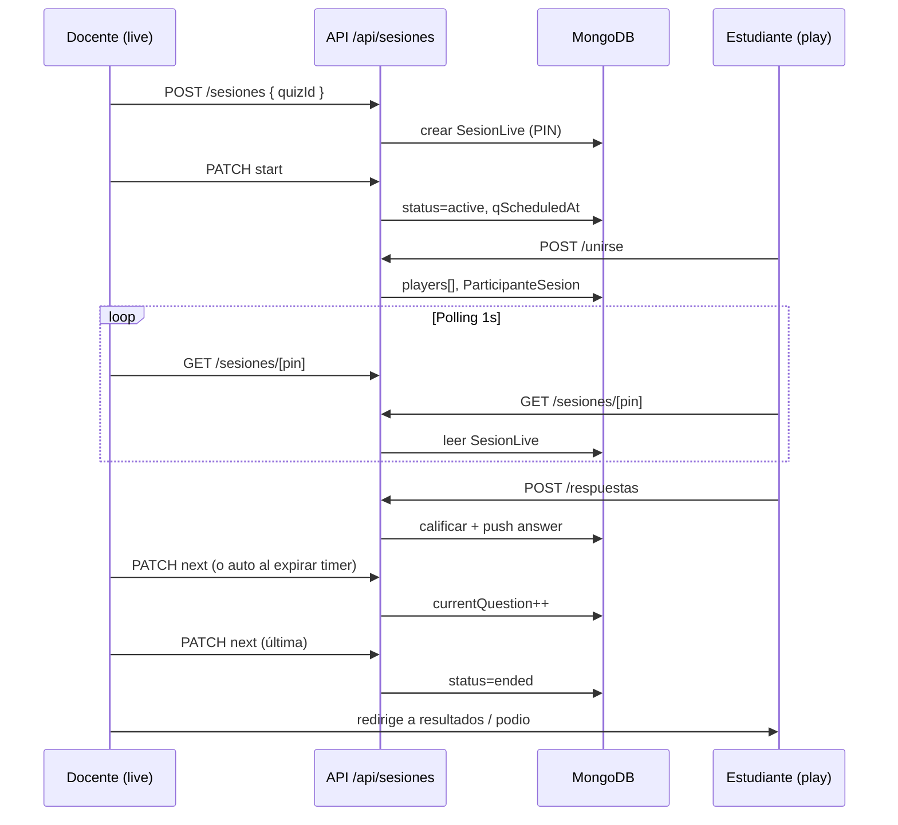

# Arquitectura

## Visión general

Electro Quiz es una aplicación **monolito Next.js** con:

- **Frontend**: React Server/Client Components en `src/app`
- **Backend**: Route Handlers en `src/app/api` (sin servidor Express separado)
- **Persistencia**: MongoDB vía Mongoose
- **Auth**: JWT en cookie HTTP-only (`eq_token`)

No hay microservicios ni capa BFF externa: el cliente llama directamente a `/api/*` con `credentials: "include`.

## Capas

```
┌────────────────────────────────────────┐
│  Presentación                          │
│  page.tsx, components, hooks           │
└────────────────┬───────────────────────┘
                 │
┌────────────────▼───────────────────────┐
│  Cliente API                           │
│  lib/client/api.ts                     │
│  lib/client/services/*.ts              │
│  lib/client/mappers/pregunta-ui.ts     │
└────────────────┬───────────────────────┘
                 │ HTTP JSON
┌────────────────▼───────────────────────┐
│  API (Route Handlers)                  │
│  validators (Zod) → services → models  │
└────────────────┬───────────────────────┘
                 │
┌────────────────▼───────────────────────┐
│  MongoDB                               │
└────────────────────────────────────────┘
```

### Presentación

- Páginas `"use client"` donde hay estado, polling o formularios interactivos.
- `ProtectedRoute` valida rol vía `GET /api/auth/me` antes de mostrar dashboards.
- Diseño institucional en `globals.css` (NOVA: primary `#1e3a5f`).

### Cliente API

- `contruirUrlApi()` normaliza paths con **trailing slash** (coherente con `next.config.mjs`).
- `apiRequest()` centraliza fetch, errores (`ApiError`) y cookies.
- Servicios por dominio: `quizzes`, `preguntas`, `sesiones`, `usuarios`, `auth`.

### API

- Cada handler: `conectarDB()` → validar body (Zod) → modelo Mongoose → `serializarDocumento` → JSON.
- Errores unificados con `manejarErrorApi` / `respuestaError`.

### Servicios de servidor

- `calificar-respuesta.ts`: validación de respuestas en servidor (fuente de verdad).
- `sesion-helpers.ts`: PIN único, serialización de sesión, filtro de presencia en lobby.

## Tiempo real (sesiones en vivo)

**Implementación:** Socket.io en `server.ts` + MongoDB como fuente de verdad.

| Mecanismo | Uso |
|-----------|-----|
| `sesion:update` (WebSocket) | Push instantáneo de estado de sesión |
| `useSesionLive` | REST inicial + socket + fallback poll 10 s |
| `useSesionTimer` | Countdown local (250 ms) con `qScheduledAt` |
| Escrituras Mongo | Solo en eventos (unirse, start, next, respuesta…) |

Guía detallada: [websockets.md](../tiempo-real/websockets.md) · Reconexión: [reconexion-y-sincronizacion.md](../tiempo-real/reconexion-y-sincronizacion.md) · Portable: [implementing-socketio.md](../tiempo-real/implementing-socketio.md).

**Escala horizontal (futuro):** adapter Redis para Socket.io si hay varias instancias Node.

## Serialización Mongo → API

Mongoose usa `_id`; la API expone `id` string:

```ts
// lib/server/utils/serializar.ts
{ ...doc, id: _id.toString() }
```

Los tipos en `src/app/types` reflejan la forma **API/UI**, no el documento crudo de Mongoose.

## Seguridad (resumen)

- Contraseñas: `bcryptjs` (select: false en modelo Usuario).
- JWT: HS256 con `jose`, expiración 7 días.
- Rutas de sesión: estudiante autenticado para unirse/responder; docente (o autor del quiz) para controlar live.
- Validación de respuestas en servidor; el cliente no define el puntaje final.

## Despliegue

- `output: 'standalone'` en Next.js para contenedor Docker / hosting Node.
- `trailingSlash: true` — **importante** al construir URLs de API en cliente.

## Diagrama: flujo de una sesión live


