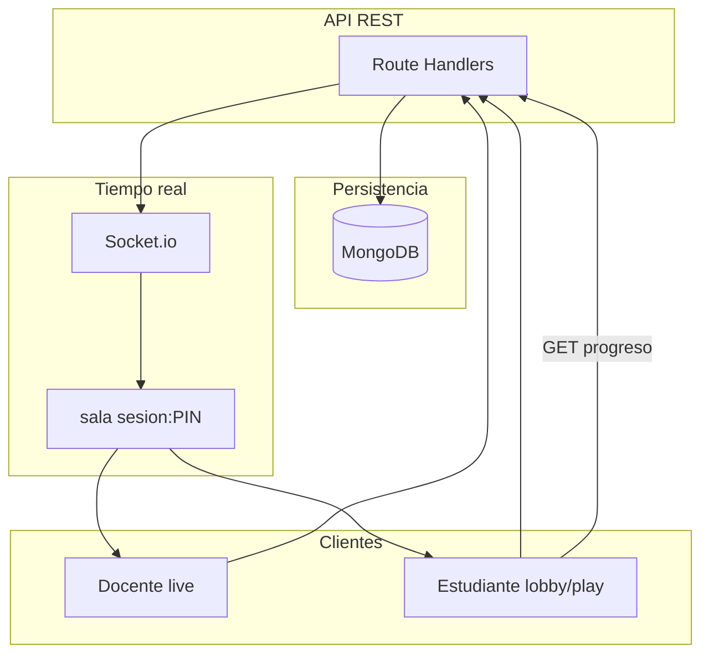
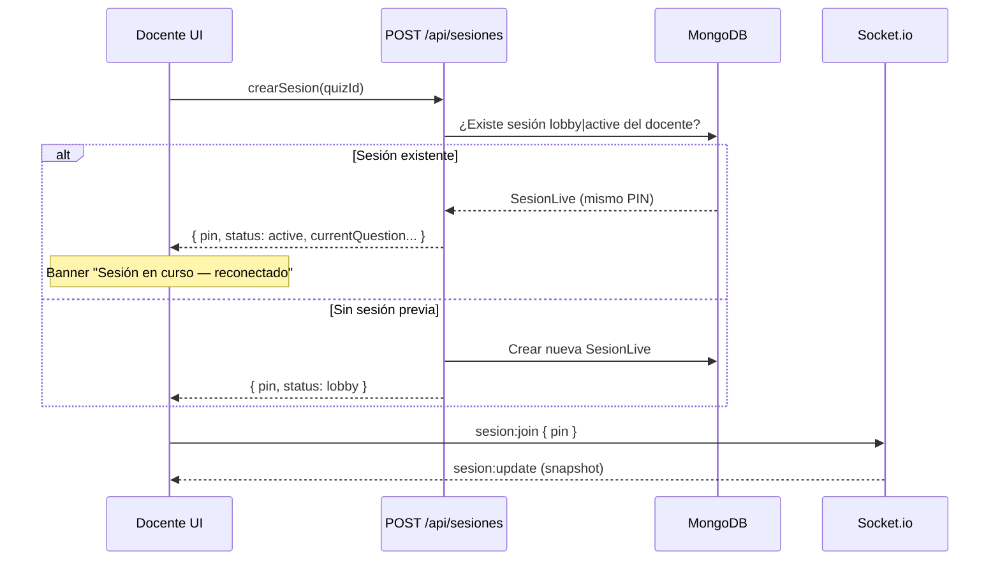
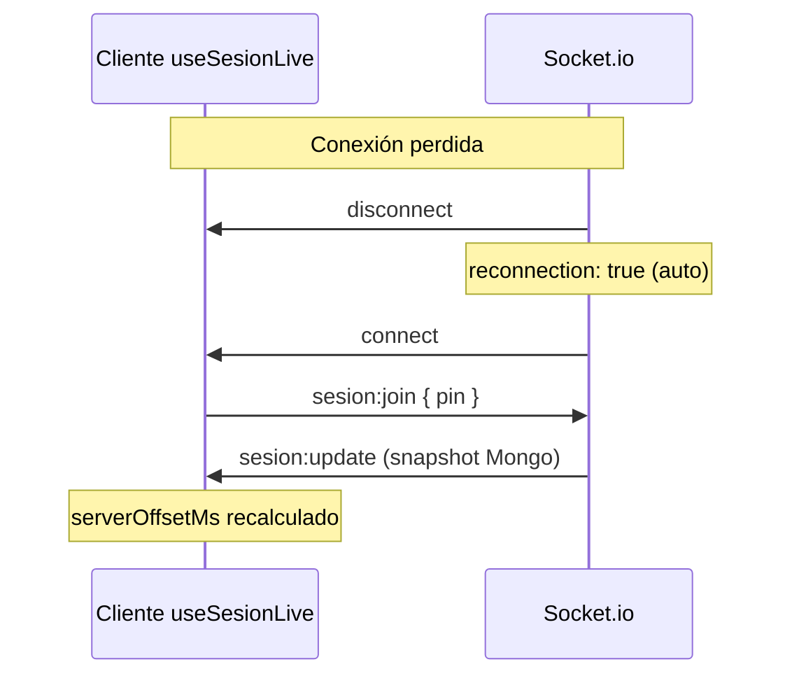

# Reconexión y sincronización

Documentación de los flujos de **reconexión** (docente y estudiante), la **sincronización de estado** entre clientes y el papel de **Socket.io** frente a MongoDB.

> Ver también: [websockets.md](./websockets.md), [live-sessions.md](./live-sessions.md), [implementing-socketio.md](./implementing-socketio.md)

---

## Principio de diseño

| Capa | Qué sincroniza | Cuándo se usa |
|------|----------------|---------------|
| **MongoDB** | Estado oficial de la sesión, jugadores, respuestas, puntajes | Siempre (fuente de verdad) |
| **API REST** | Escrituras en Mongo (start, next, unirse, respuestas…) | Eventos del usuario |
| **Socket.io** | Notificación instantánea del estado de la sala | Tras cada escritura relevante en la sesión |
| **localStorage** | PIN recordado para reconectar sin buscar | Solo UX de reingreso |
| **GET /progreso** | Respuestas y puntaje del estudiante | Reconexión en play |

**Regla:** el socket sincroniza la **sala** (pregunta actual, timer, jugadores). Mongo sincroniza el **progreso individual** del estudiante.

---

## Diagrama general



---

## Reconexión del docente

### Problema que resuelve

Si el docente cierra la pestaña, pierde conexión o navega fuera de `/teacher/quiz/[id]/live`, la sesión **sigue activa en Mongo**. Antes se creaba una sesión nueva al volver; ahora se **reutiliza la existente**.

### Flujo



### Implementación

| Pieza | Archivo | Comportamiento |
|-------|---------|----------------|
| API idempotente | `src/app/api/sesiones/route.ts` | Si ya hay `SesionLive` con `quizId` + `docenteId` y `status ∈ {lobby, active}`, devuelve esa sesión en lugar de crear otra |
| Live page | `src/app/teacher/quiz/[id]/live/page.tsx` | Llama `crearSesion(quizId)` al montar; si la respuesta trae `status: active`, muestra banner de reconexión |
| PIN local | `localStorage` key `eq_teacher_sesion_{quizId}` | Referencia opcional del PIN activo |
| Socket | `useSesionLive(pin)` | Tras cargar el PIN, reconecta al socket y recibe el estado actual |

### Qué puede hacer el docente al reconectar

- Ver la pregunta actual y el timer sincronizado.
- Pulsar **Siguiente** para avanzar manualmente.
- Esperar al auto-avance cuando el timer expire (`timerSesionExpirado`).
- Continuar hasta `status: ended` → redirección a resultados.

### Qué no hace la reconexión docente

- No reinicia el quiz desde la pregunta 1.
- No crea un PIN nuevo mientras la sesión anterior siga en `lobby` o `active`.
- No recupera respuestas de estudiantes (eso vive en `ParticipanteSesion`, no en la UI del docente).

---

## Reconexión del estudiante

Hay **tres vías** de reconexión, complementarias:

### 1. Panel `/student` — botón "Reconectar al quiz"

```mermaid
flowchart TD
  A[Estudiante abre /student] --> B{¿eq_sesion_pin en localStorage?}
  B -->|No| C[Formulario PIN normal]
  B -->|Sí| D[GET /api/sesiones/pin]
  D --> E{status}
  E -->|lobby o active| F[Banner Reconectar al quiz]
  E -->|ended| G[Limpiar localStorage]
  F --> H[POST /unirse]
  H --> I{status}
  I -->|lobby| J[/student/quiz/pin]
  I -->|active| K[/student/quiz/pin/play]
  I -->|ended| L[/student/quiz/pin/podio]
```

| Pieza | Archivo |
|-------|---------|
| Detección sesión pendiente | `src/app/student/page.tsx` |
| Guardar PIN al unirse | `localStorage.setItem("eq_sesion_pin", pin)` |
| Routing según status | Tras `unirseSesion`, redirige a lobby, play o podio |

### 2. API `POST /unirse` — reconexión con PIN

Antes solo permitía unirse si `status === "lobby"`. Ahora:

| Condición | Resultado |
|-----------|-----------|
| `status === lobby` | Unión normal (nuevo jugador o actualización `lastSeenAt`) |
| `status === active` o `ended` | Permitido **solo si** el usuario ya participó (`ParticipanteSesion` o entrada en `players[]`) |
| Sesión activa, usuario nuevo | Error: *"La sesión no está en espera…"* |

Archivo: `src/app/api/sesiones/[pin]/unirse/route.ts`

Comportamiento en reconexión durante `active`:

1. Actualiza `lastSeenAt` del jugador existente, o lo re-agrega a `players[]` si salió del lobby antes.
2. Emite `sesion:update` → el docente ve al jugador otra vez.
3. Devuelve la sesión serializada → el cliente redirige a play.

### 3. Entrada directa a play — `/student/quiz/[pin]/play`

Al montar la página play:

1. `unirseSesion(pin)` en silencio (re-registra en `players` si hace falta).
2. `useSesionLive(pin)` → REST inicial + socket `sesion:join`.
3. `GET /progreso` → restaura puntaje y respuesta de la pregunta actual si ya respondió.

Archivo: `src/app/student/quiz/[code]/play/page.tsx`

### Progreso del estudiante (`GET /progreso`)

Restaura:

- `totalScore`
- `currentQuestionAnswer` (respuesta, si fue correcta, tiempo congelado)

El socket **no** transporta respuestas individuales; solo el índice `currentQuestion` de la sesión.

---

## Reconexión del socket (técnica)

Independiente del rol, cuando cae la conexión WebSocket:



| Paso | Detalle |
|------|---------|
| 1 | `socket.io-client` reintenta con backoff (`reconnectionDelay` 1–5 s) |
| 2 | Evento `connect` → emite `sesion:join` |
| 3 | Servidor valida JWT + pertenencia a la sesión |
| 4 | Servidor envía `sesion:update` con `serverTime` |
| 5 | `useSesionTimer` recalcula `timeLeft` con el offset nuevo |

Hook: `src/hooks/useSesionLive.ts`

### Fallback sin WebSocket

Si el socket no conecta (firewall, proxy):

- Poll REST cada **10 s** mientras `socketConnected === false`.
- Heartbeat en lobby usa REST si el socket está caído.

---

## Sincronización del timer

El timer **no** se emite segundo a segundo por socket. Todos los clientes calculan localmente:

```
serverOffsetMs = serverTime - Date.now()   // en cada sesion:update
elapsed        = (Date.now() + serverOffsetMs) - qScheduledAt
timeLeft       = clamp(qTimeLimitSec - elapsed/1000, 0, qTimeLimitSec)
```

| Campo Mongo | Significado |
|-------------|-------------|
| `qScheduledAt` | Instante en que **empieza** el countdown de la pregunta actual |
| `qTimeLimitSec` | Duración total (por pregunta, puede variar) |
| `serverTime` | Timestamp del servidor en cada payload (solo en socket/serialización) |

Archivos compartidos:

- `src/lib/client/sesion-timer.ts` — funciones puras
- `src/hooks/useSesionTimer.ts` — hook React
- `timerSesionExpirado()` — evita auto-avance antes de que el countdown empiece

Delays al programar en API:

| Acción | Delay |
|--------|-------|
| `start` | +2000 ms |
| `next` | +800 ms |

### Auto-avance docente

Cuando `timerSesionExpirado()` es true → `PATCH { action: "next" }`.

**Importante:** no usar solo `timeLeft === 0` del estado React inicial; el timer se inicializa en el primer render y puede disparar un falso positivo.

---

## Sincronización de pregunta actual

| Evento | Quién lo dispara | Qué reciben los clientes |
|--------|------------------|--------------------------|
| `start` | Docente | `status: active`, `currentQuestion: 0`, timer Q0 |
| `next` | Docente o auto-avance | `currentQuestion: N+1`, nuevo timer |
| `end` | Última pregunta | `status: ended` |

Todos los clientes en la sala `sesion:{pin}` reciben el mismo `sesion:update` al instante.

El estudiante en play:

1. Lee `session.currentQuestion` del hook.
2. Carga la pregunta correspondiente del quiz (`listarPreguntas`).
3. Resetea UI de respuesta al cambiar de índice.
4. Consulta `/progreso` por si ya había respondido esa pregunta.

---

## Presencia de jugadores

| Acción | Lobby | Active |
|--------|-------|--------|
| `POST /unirse` | Agrega a `players`, emite socket | Reconexión: actualiza o re-agrega |
| `POST /salir` | Quita de `players`, emite socket | **No** quita (conserva participante) |
| `sesion:heartbeat` | Actualiza `lastSeenAt`, emite si lobby | Actualiza `lastSeenAt`, sin emitir |
| Timeout ~45 s sin heartbeat | Oculto en serialización (lobby) | Siempre visible |

---

## localStorage utilizado

| Key | Rol | Uso |
|-----|-----|-----|
| `eq_sesion_pin` | Estudiante | PIN del quiz en curso; banner reconectar en `/student` |
| `eq_teacher_sesion_{quizId}` | Docente | Referencia del PIN activo por quiz |

No sustituyen la autenticación JWT ni la validación en API.

---

## Matriz de escenarios

| Escenario | Docente | Estudiante |
|-----------|---------|------------|
| Cierra pestaña en lobby | Vuelve → misma sesión lobby | Vuelve con PIN → reconecta al lobby |
| Cierra pestaña en active | Vuelve → misma sesión active, banner | Panel → Reconectar, o play directo |
| Pierde internet 30 s | Socket reconecta + snapshot | Igual + progreso vía REST |
| Socket bloqueado | Poll REST 10 s | Poll REST 10 s |
| Nuevo estudiante mid-quiz | — | Rechazado (no estaba en lobby) |
| Estudiante salió del lobby explícitamente | — | Puede volver si tiene `ParticipanteSesion` |
| Quiz terminó | Redirige a resultados | Redirige a podio |

---

## Errores comunes (actualizados)

| Mensaje | Causa | Solución |
|---------|-------|----------|
| *La sesión no está en espera* | PIN válido pero sesión `active` y usuario **nunca** se unió | Solo participantes previos pueden reconectar |
| *No estás registrado en esta sesión* (socket) | `sesion:join` sin estar en `players` ni ser docente | Llamar `POST /unirse` antes del socket |
| Timer desincronizado | Reloj del cliente muy desviado | `serverTime` corrige offset; revisar NTP del servidor |
| Se saltaba la 1.ª pregunta | Auto-avance con `timeLeft` inicial en 0 | Usar `timerSesionExpirado()` + init del timer |

---

## Checklist para depurar reconexión

1. ¿Arrancaste con `npm run dev` (no `next dev`)?
2. ¿Cookie `eq_token` presente?
3. ¿El usuario está en `players[]` o es el docente?
4. ¿`POST /unirse` devolvió 200 antes del play?
5. ¿DevTools → Network → WS muestra `/api/socket` conectado?
6. ¿`useSesionLive` reporta `socketConnected: true`?
7. ¿`GET /progreso` devuelve el puntaje esperado?
