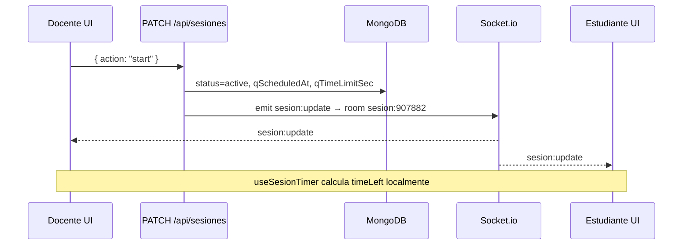

# WebSockets con Socket.io

Guía de la arquitectura en tiempo real de **Electro Quiz**: cómo funciona, por qué está diseñada así y cómo depurarla.

## Idea central

```
┌─────────────────────────────────────────────────────────────┐
│  MongoDB = fuente de verdad (Single Source of Truth)        │
│  - SesionLive, ParticipanteSesion, respuestas, quizzes      │
└───────────────────────────┬─────────────────────────────────┘
                            │ escribe solo en eventos
┌───────────────────────────▼─────────────────────────────────┐
│  API REST (Next.js Route Handlers)                          │
│  POST/PATCH /api/sesiones → guarda en Mongo → emite socket  │
└───────────────────────────┬─────────────────────────────────┘
                            │ push instantáneo
┌───────────────────────────▼─────────────────────────────────┐
│  Socket.io (mismo servidor HTTP, path /api/socket)            │
│  Salas: sesion:{pin} → evento sesion:update                   │
└───────────────────────────┬─────────────────────────────────┘
                            │
         ┌──────────────────┼──────────────────┐
         ▼                  ▼                  ▼
    Docente live       Estudiante lobby    Estudiante play
```

**MongoDB persiste. Socket.io notifica.** No se guarda el timer segundo a segundo en ningún sitio.

---

## Por qué un servidor custom (`server.ts`)

Next.js App Router **no soporta WebSockets** en `route.ts`. Socket.io necesita el servidor HTTP de Node.

Por eso:

- `npm run dev` → `tsx watch server.ts` (Next + Socket.io)
- `npm run start` → `tsx server.ts` en producción
- **No uses** `next dev` / `next start` solos: el socket **no arrancará**.

---

## Archivos del sistema

| Archivo | Rol |
|---------|-----|
| `server.ts` | Crea HTTP server, monta Next.js y Socket.io |
| `src/lib/server/socket/io.ts` | Instancia global `getSocketIO()` / `setSocketIO()` |
| `src/lib/server/socket/setup.ts` | Auth JWT, eventos `join` / `leave` / `heartbeat` |
| `src/lib/server/socket/broadcast.ts` | `emitirActualizacionSesion(pin)` tras escribir Mongo |
| `src/lib/client/socket.ts` | Cliente singleton `obtenerSocket()` |
| `src/hooks/useSesionLive.ts` | Hook React: REST inicial + socket + fallback |
| `src/app/types/socket.ts` | Nombres de eventos y tipos compartidos |

---

## Eventos Socket.io

Definidos en `SOCKET_EVENTS` (`src/app/types/socket.ts`):

| Evento | Dirección | Cuándo |
|--------|-----------|--------|
| `sesion:join` | Cliente → servidor | Al conectar o reconectar; entra en sala `sesion:{pin}` |
| `sesion:leave` | Cliente → servidor | Al desmontar componente o cambiar de PIN |
| `sesion:heartbeat` | Cliente → servidor | Cada 15 s en lobby; actualiza `lastSeenAt` en Mongo |
| `sesion:update` | Servidor → clientes | Tras cualquier cambio persistido en la sesión |
| `sesion:error` | Servidor → cliente | PIN inválido, no autenticado, no registrado en sesión |

### Payload de `sesion:update`

Es el mismo objeto que devuelve `GET /api/sesiones/[pin]/`:

- `status`, `currentQuestion`, `qScheduledAt`, `qTimeLimitSec`
- `players[]`, `sessionName`, `quizId`
- **`serverTime`** (ms) para sincronizar el countdown

---

## Flujo completo: docente inicia pregunta



1. El docente pulsa **Empezar** → `PATCH` con `action: "start"`.
2. La API escribe en `SesionLive` y llama `emitirActualizacionSesion(pin)`.
3. Todos los clientes en la sala reciben `sesion:update` **al instante**.
4. `useSesionTimer` recalcula el tiempo con `qScheduledAt` + `serverTime`.

---

## Flujo: estudiante se une

1. `POST /api/sesiones/[pin]/unirse` → Mongo (`players[]`, `ParticipanteSesion`).
2. API emite `sesion:update` → el docente ve al jugador sin esperar.
3. Estudiante entra al lobby → `useSesionLive` conecta socket y emite `sesion:join`.
4. Servidor valida JWT + que el usuario esté en `players` o sea el docente.
5. Servidor responde con snapshot `sesion:update` (reconexión incluida).

---

## Autenticación

- Login JWT en cookie **`eq_token`** (httpOnly).
- El cliente Socket.io usa `withCredentials: true` → la cookie viaja en el handshake.
- Middleware en `setup.ts` lee la cookie y ejecuta `verifyToken`.
- Sin token válido → conexión rechazada.

---

## Reconexión

Socket.io-client trae **reconexión automática** (`reconnection: true`).

### Reconexión del transporte (socket)

Al reconectar la conexión WebSocket:

1. Evento `connect` → el hook emite de nuevo `sesion:join`.
2. Servidor envía snapshot actual desde Mongo.
3. `serverOffsetMs` se recalcula con `serverTime`.

### Reconexión de aplicación (docente y estudiante)

| Rol | Mecanismo | Documentación |
|-----|-----------|---------------|
| Docente | `POST /sesiones` devuelve sesión `lobby\|active` existente del mismo quiz | [reconexion-y-sincronizacion.md](./reconexion-y-sincronizacion.md#reconexión-del-docente) |
| Estudiante | `POST /unirse` permite reingreso si ya participó; banner en `/student` | [reconexion-y-sincronizacion.md](./reconexion-y-sincronizacion.md#reconexión-del-estudiante) |
| Play | `GET /progreso` restaura puntaje y respuesta de la pregunta actual | Idem |

El socket sincroniza **estado de la sala**; Mongo sincroniza **progreso del estudiante**.

Guía completa: **[reconexion-y-sincronizacion.md](./reconexion-y-sincronizacion.md)**

Para implementar este patrón en otro proyecto: **[implementing-socketio.md](./implementing-socketio.md)**

---

## Timer (countdown)

El socket **no envía** `timeLeft` cada segundo.

| Campo Mongo | Significado |
|-------------|-------------|
| `qScheduledAt` | Instante en que empieza el countdown |
| `qTimeLimitSec` | Duración de la pregunta |

Cálculo compartido (`src/lib/client/sesion-timer.ts` + `useSesionTimer`):

```
elapsed = (Date.now() + serverOffsetMs) - qScheduledAt
timeLeft = clamp(qTimeLimitSec - elapsed/1000)
```

`serverOffsetMs` viene de `serverTime` en cada `sesion:update`.

---

## Fallback si WebSocket falla

Si el socket no conecta (proxy, firewall):

- `useSesionLive` hace **poll REST cada 10 s** (solo mientras `socketConnected === false`).
- Carga inicial siempre por `GET /api/sesiones/[pin]`.

---

## Dónde se emite `sesion:update`

| Acción API | Emite socket |
|------------|--------------|
| `POST /api/sesiones` (crear) | Sí |
| `PATCH` start / next / end / updateName | Sí |
| `POST /unirse` | Sí |
| `POST /salir` (solo lobby) | Sí |
| `POST /heartbeat` o `sesion:heartbeat` (solo lobby) | Sí |
| `POST /respuestas` | No (solo afecta al participante; progreso vía REST) |

---

## Salas (rooms)

```ts
roomSesion("907882") // → "sesion:907882"
```

Solo los sockets que emitieron `sesion:join` con ese PIN reciben updates.

---

## Variables de entorno

| Variable | Uso |
|----------|-----|
| `PORT` | Puerto HTTP (default 3000) |
| `HOSTNAME` | `0.0.0.0` para acceso móvil en LAN (`npm run dev:mobile`) |
| `NEXT_PUBLIC_SOCKET_URL` | Opcional; URL del socket si difiere del origin |
| `NEXT_PUBLIC_APP_URL` | CORS en producción |
| `MONGODB_URI`, `JWT_SECRET` | Sin cambios |

---

## Depuración

1. Arranca con `npm run dev` (no `next dev`).
2. DevTools → Network → WS → conexión a `/api/socket`.
3. Consola servidor: conexiones `[socket]`.
4. En React: `useSesionLive` expone `socketConnected: boolean`.
5. Si no conecta: revisar cookie `eq_token` y que estés logueado.

---

## Aprendizaje: analogía

- **MongoDB** = cuaderno oficial del profe (notas definitivas).
- **API REST** = cuando el profe escribe en el cuaderno.
- **Socket.io** = megáfono que avisa a la clase al instante.
- **Timer** = todos miran el mismo reloj de pared (`qScheduledAt`), no un cronómetro que se pasa de mano.

---

## Firebase

El live **no usa Firebase**. RTDB/Firestore fueron reemplazados por **Mongo + Socket.io**. El paquete `firebase` puede quedar en el repo por legacy en otros módulos, pero no interviene en sesiones live.

Ver también: [live-sessions.md](./live-sessions.md), [architecture.md](../arquitectura/architecture.md), [reconexion-y-sincronizacion.md](./reconexion-y-sincronizacion.md), [implementing-socketio.md](./implementing-socketio.md).
